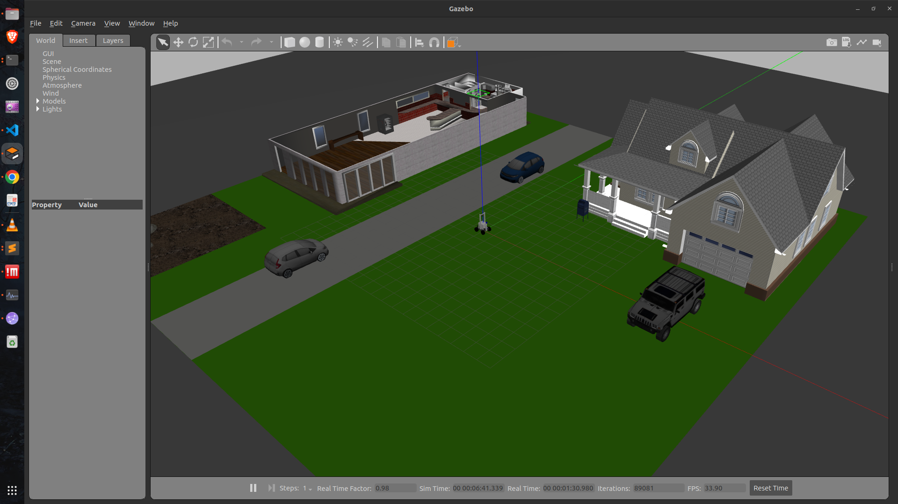
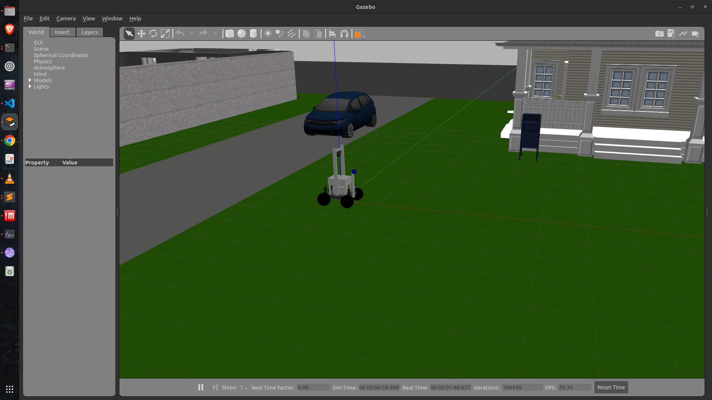

# Simulations

This directory contains all required packages for simulations. This simualtion is tested out on ROS2 Humble.

## Packages:
1. **rover_description:** This package encompasses all definitions of the rover robot model for simulation.
2. **rover_simulation_control:** It contains all launch & nodes files for the model description. 

## Standard Dependencies

To install required dependencies use following commands after downlaoding the required packages.


```bash
$ sudo rosdep init
$ rosdep update
$ rosdep install --from-paths src -y --ignore-src
```

## Custom Dependencies Packages:
Following custom packages are also required to run the simualtion.

- direct_drive_interface
- kinematic_model_interface
- remote_joystick_control
- rover_custom_msgs

## Install PS4 python library
To install python library for Ps4 controller.

```bash
$ sudo pip install pyPS4Controller
```

## Launch files:

### digital_twin_launch.py
To execute the digital twin in Gazebo, it requires linear and angular velocities from the actual robot. It utilizes the default Gazebo plugin for skid steer drive.

```bash
$ ros2 launch rover_simulation_control digital_twin_launch.py
```

## rover_world_launch.py
To launch simulation in Gazebo custom world and allow teleoperation via a PS4 controller using kmodel drive. It will publish the following nodes:

- joint_state_publisher_node
- robot_state_publisher_node
- spawn_entity
- joint_state_broadcaster
- forward_velocity_controller
- kmodel_control_interface
- kmodel_ps4_joystick
- cmd_publisher

```bash
$ ros2 launch rover_simulation_control rover_world_launch.py 
```





### gazebo_cmd_ddrive_setup_launch.py
To launch simulation in Gazebo and allow teleoperation via a PS4 controller using direct drive. It will publish the following nodes:

- joint_state_publisher_node
- robot_state_publisher_node
- spawn_entity
- joint_state_broadcaster
- forward_velocity_controller
- ddrive_control_interface
- ddrive_ps4_joystick
- cmd_publisher

```bash
$ ros2 launch rover_simulation_control gazebo_cmd_ddrive_setup_launch.py 
```

### gazebo_cmd_kmodel_setup_launch.py
To launch simulation in Gazebo and allow teleoperation via a PS4 controller using kmodel drive. It will publish the following nodes:

- joint_state_publisher_node
- robot_state_publisher_node
- spawn_entity
- joint_state_broadcaster
- forward_velocity_controller
- kmodel_control_interface
- kmodel_ps4_joystick
- cmd_publisher

```bash
$ ros2 launch rover_simulation_control gazebo_cmd_kmodel_setup_launch.py 
```

## Note: 
- It may take 15 - 30 seconds to  upload properly setup.
- If starting with senors enabled might take ~1 minute. 
- By default all the plugins for sensors are not enabled because of high processing power consumption. 
- Sensors plugins can be enabled by modifying their respective xacro file, instructions to enables them or given into xacro file. 
- You may have to change the port name "/dev/input/js1" in file 
   - src/Dependencies_pkg/remote_joystick_control/remote_joystick_control/ps4joystick_ddrive_cmd_node.py
   - src/Dependencies_pkg/remote_joystick_control/remote_joystick_control/ps4joystick_kmodel_cmd_node.py